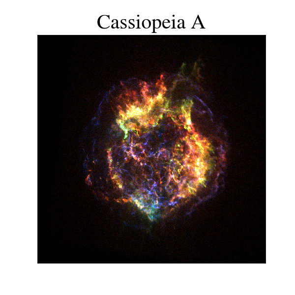

## Homework 9 - Image Processing in Python

This homework contains all the work in the `HW9.ipynb` notebook. 

In this assignment we 

* Track an asteroid across time series images
* Create a panorama by stitching images together with scikit-image
* Stack `FITS` files to create an RGB image of a Stellar Object: Cassiopeia A

### Example Images Below:

#### Panorama

  

#### Cassiopeia A

  

